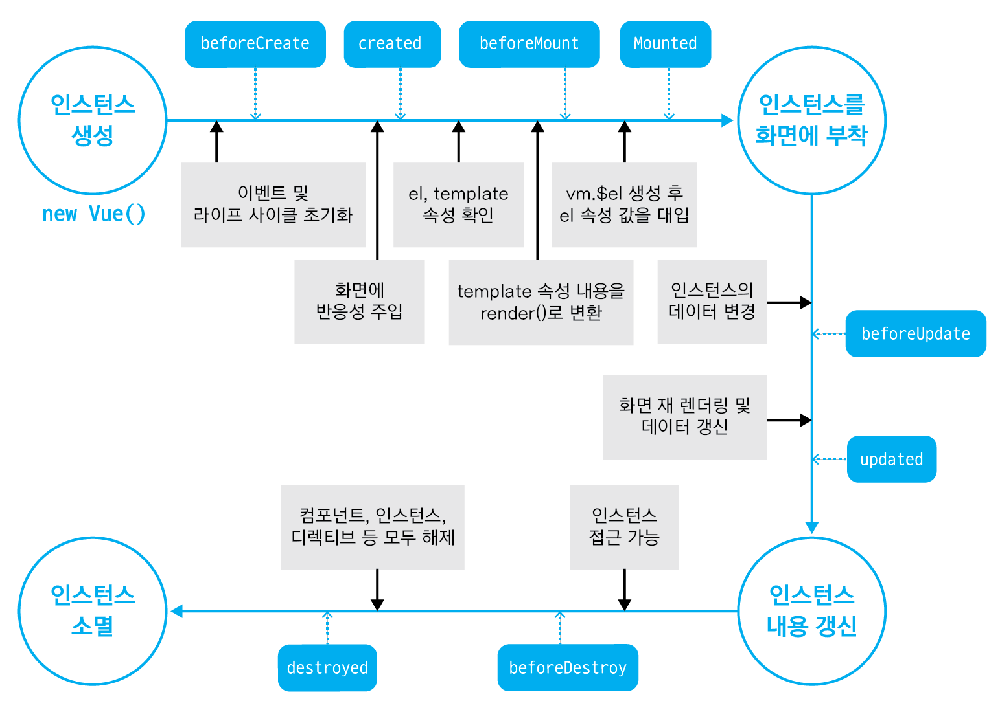

# VUE INSTANCE

- Vue Instance를 여러개를 생성할 수 도 있음. 
  - `  var vm1 = new Vue({`
  -  `var vm2 = new Vue({`
- Vue Instance를 또다른 Vue Instance 내에 호출하는 것도 가능하며 인스턴스 외부에서도 호출이 가능함

```javascript
setTimeout(function(){
    vm1.title = 'Changed by timer';
    vm1.show()
}, 3000);  

var vm2 = new Vue({
    el: '#app2',
    data: {
      title: 'The VueJS Instance2',
    },
    methods: {
      onChange: function() {
        vm1.title = 'Changed!'
      }
    }
  });  
```


Vue Instance를 콘솔창에 출력하면 많은 정보들이 출력되는데, 이중에서 `$el` , `$data` , `$ref` 에 대해 살펴보자

`$el`  - Vue Instance의 html 코드를 의미함.

`$data` -  Vue Instance - data 속성에 저장된 data 오브젝트를 의미함.

`$ref` - 


아래 button 태그 내 Show Paragraph 처럼, html 엘리먼트 내 내용을 갖고오고 싶을 때, 바닐라 JS의 경우 querySelector를 이용해서 갖고올 수 있음.  vue.js에서는 ref를 사용해서 내용을 갖고 올 수 있음. ref를 통해 Vue는 어떠한 엘리먼트든 간에 인지를 할 수 있음.

ref를 다중으로 입력할 수 도 있음.

```html
<!-- 사용 전 -->
<button v-on:click="show">Show Paragraph</button>

<!-- 사용 후 -->
<h1 ref="heading">{{ title }}</h1>
<button v-on:click="show" ref="myButton">Show Paragraph</button>
```

Vue 인스턴스 내부에서는 `this.$refs`를 이용해서 html 엘리먼트에서 사용한 모든 ref에 접근을 할 수 있음.

자바스크립트 오브젝트 형태로 출력됨. key는 html 엘리먼트 내에서 입력한 이름이 들어감 value에는 태그명이 들어감.

`this.$refs.myButton.innerText = 'test'` 처럼 Vue 인스턴스 내에서  엘리먼트를 조작도 가능함

```javascript
methods: {
    show: function() {
        this.showParagraph = true;
        this.updateTitle('The VueJS Instance (Updated)');
        console.log(this.$refs);
    },
```

```javascript
{heading: h1, myButton: button}
 heading: h1
 myButton: button
  __proto__: Object
```


$refs는 인스턴스 안/밖 관계없이 사용가능

보간법으로 Vue가 조작하고 있는 엘리먼트에 ref를 사용한 후, 내용을 조작할 경우,  내용이 무조건 덮어쓰이진 않음. Vue는 ref가 html 코드를 조작한다고 판단함. DOM을 직접적으로 조작하나 vue의 template을 변경시키지는 않음. 그러므로 Vue가 DOM을 re-render할 경우,  old tempate을 사용한 후, 다시 new template으로 re-render 시킴.

ref 조작은 reactive하지 않음. DOM을 직접적으로 조작하는 것. native 엘리먼트에 접근하여 value를 갖고올 때 유용.


#### mounting

el 속성을 이용해서 Vue 인스턴스를 DOM의 어느 엘리먼트에 적용시킬지를 설정함.

`$mount()` 는 Vue에서 제공하는 메서드로, el과 유사한 기능을 제공함.  아래의 두 코드는 동일하게 작동함

```javascript
var vm1 = new Vue({
	el: '#app'
})

vm1.$mount('#app')
```


you want to configure and set up your vue instance but you don't know yet where to mount it or the object, the html element where you want to mount it doesn't exist yet. In such a case, you could create it, execute some other code and once you know where to mount it, you can call the variable name where you stored your instance.


$mount와 template 이라는 속성을 활용할 수 도 있음

template의 값으로는 string이 들어가야함.

h1 태그로 감싸진 Hello가 화면에 출력됨.

```javascript
  var vm3 = new Vue({
    template: '<h1>Hello</h1>'
  })

  vm3.$mount('#app3')
```


아래처럼 다른 방법으로도 나타낼 수 있음

```javascript
vm3.$mount()
document.getElementById('app3').appendChild(vm3.$el)
```


vue 인스턴스 내 코드를 재사용 &  반복해서 쓰고 싶을 경우?  component 사용

고유의 template과 selector를 부여

첫번째 인자로는 component가 사용될 선택자가 들어감. 두번째 인자로는 우리가 넘길 오브젝트를 입력

```html
<div id="app2">
    <h1>{{ title }}</h1>
    <button @click="onChange">Change something in Vue 1 </button>
    <hello></hello>
    <hello></hello>
    <hello></hello>
</div>
<script>
  Vue.component('hello', {
    template: '<h1>Hello </h1>'
  });
</script>
```


Vue는 template을 갖고 있음.  template을 DOM에 적용시키는 것.


Vue Instance 내 속성 또는 데이터는 DOM 내 엘리먼트와 서로 연결되어있음. 서로를 watch 하고 필요하다면 update 시킴. 만약 값이 변했다고 해서 , 지속적으로 DOM 내 모든것을 업데이트시키지는 않음.  자바스크립트는 매우 속도가 빠르나, DOM에 접근하는 것은 매우 느림.  따라서, DOM을 직접적으로 & 지속적으로 업데이트 하는 횟수를 최소화시켜야함. 이 때 Vue Instance 와 DOM 사이에 virtual DOM 이라는 또다른 layer를 사용함.  (DOM의 복사본). 그러나 자바스크립트를 가공한 DOM이므로 실제 DOM의 접근이 매우 빠름.

Vue Js는 Virtual DOM과 watch & check 하여 상태를 업데이트 시키고, 실제 DOM에 대해서 업데이트를 시킴.


#### life cycle

```html
<body>
  <div id="app">
    <h1> {{ title }} </h1>
    <button @click="title = 'Changed'"> Update title</button>
    <button @click="destroy"> Destroy </button>
  </div>  
</body>
<script>
  new Vue({
    el: '#app',
    data: {
      title: 'The VueJS Instance'
    },
    // Vue Instance 생성 전 실행
    beforeCreate: function() {
      console.log('beforeCreate()')
    },
    // 인스턴스 생성 직후. data와 event 활성화. 접근 가능
    created: function() {
      console.log('created()')
    },
    // 인스턴스를 생성했으나, DOM에 mount 시키기 전.
    beforeMount: function() {
      console.log('beforeMount()')
    },
    // DOM에 붙여짐. 브라우저를 통해 확인 가능
    mounted: function() {
      console.log('mounted()')      
    },
    // 데이터가 변경될 경우, DOM에 업데이트 되기 바로 직전에 실행됨.
    beforeUpdate() {
      console.log('beforeUpdate()')
    },
    // DOM이 업데이트된 직후
    updated() {
      console.log('updated()')
    },
    // 인스턴스가 제거되기 직전
    beforeDestroy() {
      console.log('beforeDestroy()')
    },
    // 인스턴스가 제거 된 후. cleanup work가 필요할 때 사용. watcher, event listener 등 제거 
    destroyed() {
      console.log('Destroy()')
    },
    methods: {
      destroy: function() {
        this.$destroy();
      }  
    }
  })
</script>
```



